## 完整接线方案

### MAX30102 绿板 → STM32

|MAX30102|STM32|丝印|
|---|---|---|
|VIN|3.3V|`3.3`|
|GND|GND|`G`|
|SCL|PB6|`B6`|
|SDA|PB7|`B7`|
|INT|PA0|`A0`|
|IRD|悬空|—|
|RD|悬空|—|

### SHT30 → STM32（与MAX30102共享I2C1）

|SHT30|STM32|丝印|
|---|---|---|
|VCC|3.3V|`3.3`|
|GND|GND|`G`|
|SCL|PB6|`B6`|
|SDA|PB7|`B7`|

### 正点原子BLE 5.4 → STM32（USART2）

|BLE引脚|STM32|丝印|说明|
|---|---|---|---|
|VCC|3.3V|`3.3`|—|
|GND|GND|`G`|—|
|RXD|PA2|`A2`|USART2_TX，**MCU发→模块收**|
|TXD|PA3|`A3`|USART2_RX，**模块发→MCU收**|
|STA|PA1|`A1`|GPIO输入，检测连接状态|
|WUP|PA4|`A4`|GPIO输出，正常工作保持高电平|
|RELOAD|PA5|`A5`|GPIO输出，低脉冲>500ms恢复出厂|

### 调试串口 USART1 → USB-TTL模块

|STM32|丝印|接USB-TTL|
|---|---|---|
|PA9（TX）|`A9`|RX|
|PA10（RX）|`A10`|TX|
|GND|`G`|GND|

### 有源蜂鸣器 → STM32

|器件|接点|说明|
|---|---|---|
|基极（串1kΩ）|PB0（`B0`）|高电平触发响|
|集电极|蜂鸣器"+"极|蜂鸣器另端接3.3V|
|发射极|GND|—|

---

## 与上一版的变化对比

|资源|上一版|本版|
|---|---|---|
|BLE串口|USART1（PA9/PA10）|**USART2（PA2/PA3）**|
|调试串口|未明确分配|**USART1（PA9/PA10）**|
|BLE控制GPIO|PA1/PA2/PA3|**PA1/PA4/PA5**（让出PA2/PA3给USART2）|

两个串口完全独立，互不干扰，CubeMX里同时开启USART1和USART2即可。